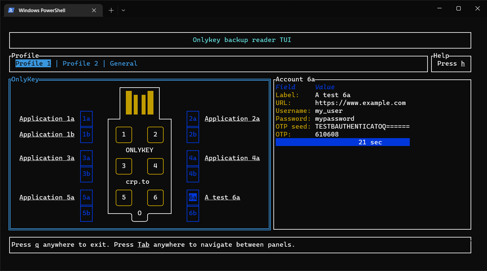

# OnlyKey backup reader TUI
[](https://github.com/SimonVareille/OnlyKey-backup-reader/actions/workflows/rust.yml) [](https://github.com/SimonVareille/OnlyKey-backup-reader/releases/latest)

Read and use an [OnlyKey](https://onlykey.io/) backup from the terminal.



## Summary

*OnlyKey backup reader* is a terminal user interface (TUI) application written in Rust that enables
you to view and use an OnlyKey's backup as if it was loaded on an actual OnlyKey.

In case you lost access to your OnlyKey and don't have a spare one available, you can use this
application as a **temporary** replacement.

You can also use this app to obtain a raw unencrypted backup. Use the `-r` option to save this raw
backup to a file. The best way to read this file afterward is to open it with an hexadecimal
editor. The format of the backup is described in [backup-format.md](backup-format.md).

This app won't modify the backup.

Backups for the OnlyKey Duo should work too, but not tested.

## Features

*OnlyKey backup reader* currently supports the following features.

### Backup decoding
- [x] Read passphrase-protected backup  
- [x] Read ECC-protected backup
  - [x] With X25519 key
  - [x] With NIST256P1 key
  - [x] With SECP256K1 key
- [x] Read RSA-protected backup  

### Data displayed

For both profiles:

- [x] Label
- [x] URL
- [x] Username
- [x] Password
- [x] OTP
  - [x] OATH-TOTP (Google Authenticator)
  - [x] OATH-TOTP Seed
  - [x] Yubico OTP
  - [x] Yubico OTP Seed

For other data:

- [x] ECC private keys (currently only the first 16 keys (101-116))
  - [x] X25519
  - [x] NIST256P1
  - [x] SECP256K1
- [x] HMACSHA1 secret
- [X] RSA private keys
  
### Notes

#### Yubico OTP

Yubico OTP is a counter-based OTP. Therefore, any backup made before using a Yubico OTP would be
desynchronized (the counter of the backup would be lower than the counter of the key). To overcome
this *OnlyKey backup reader* enables you to increment the counter (by pressing *+*). 

Given that I don't use this feature, the testing process has been quite light. This should work, but
I can't guaranty it.

Feel free to create an [Issue](https://github.com/SimonVareille/OnlyKey-backup-reader/issues/new/choose)
if you find a bug.

### Uncovered data

#### FIDO and FIDO2

Displaying FIDO and FIDO2 keys without actually using them woud be of little to no use. I don't
plan to support them for the moment.

## Usage
```
$ okbr.exe --help
okbr 1.1.0
svareille
A cross-platform OnlyKey backup reader

USAGE:
    okbr.exe [OPTIONS] <BACKUP>

ARGS:
    <BACKUP>    Path to the OnlyKey backup to load

OPTIONS:
    -h, --help                 Print help information
    -q, --quiet                Less output per occurrence
    -r, --raw-output <FILE>    If present, store the decrypted raw backup in the specified file
    -v, --verbose              More output per occurrence
    -V, --version              Print version information
```

### Inside the TUI: 
- Navigate between panels with *Tab* and *Shift+Tab*.
- Use the keyboard's arrows to move inside a panel, and *Enter* to select selectable things.

Anywhere:
- Press *q* to immediately quit the app.
- Press *h* to display an help popup.
- Press *s* to toggle the visibility of secrets.
- Press *Escape* to quit current popup.

When a *profile* panel is on screen:
- Press *l* to copy the label into the clipboard.
- Press *U* to copy the URL into the clipboard.
- Press *u* to copy the username into the clipboard.
- Press *p* to copy the password into the clipboard.
- Press *o* to copy the OTP into the clipboard.
- Press *O* to copy the OTP seed into the clipboard.
- Press *r* to reload (recompute) the OTP.
- Press *+* to increment the OTP counter (for Yubico OTP).
  
When an ECC key is selected on the *general* panel:
- Press *k* to copy the private key into the clipboard.

When an RSA key is selected on the *general* panel:
- Press *k* to copy the private key into the clipboard as the concatenation of hexadecimal `p` and
  `q` parameters.
- Press *K* to copy the private key into the clipboard as a PKCS#8 PEM.

## Security considerations

Using this app exposes both the backup and it's decryption key to the computer running it.
Therefore only use it as a last resort, and exclusively on a computer you fully trust.

However, this is as safe as loading both the backup key and the backup on an OnlyKey from the same
computer. For more security, load the backup key and the backup from two different computers. That
way, no device would knows both the backup and the key at the same time.
